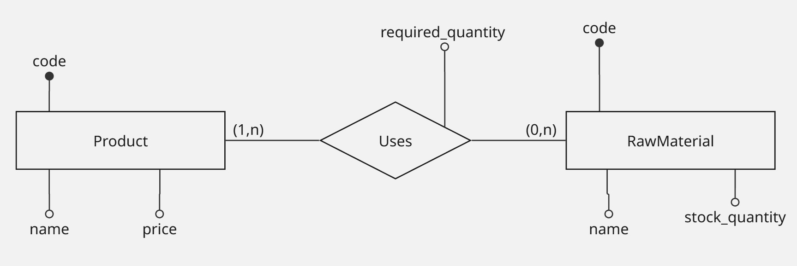

# Desafio Técnico Projedata - Sistema AutoFlex

Este repositório contém a solução completa para o desafio de Desenvolvedor Full Stack Júnior. O projeto foca na gestão industrial de estoque e otimização de produção.

## Modelagem de Dados (DER)
Modelo conceitual para facilitar entendimento do contexto:

Interpretação:
- Todo Product deve usar pelo menos 1 RawMaterial
- Uma RawMaterial pode ou não estar associada a algum Product

#

### 📁 Organização do Repositório
- `backend`: Back-end (API) com Spring Boot Versão 4.0.2 e Java 21
    - Consulte o README interno para instruções de execução e endpoints
- `frontend`: Front-end com Angular 16+
    - Consulte o README interno para instruções de build e execução
- `docs`: Documentação técnica, incluindo o Modelo Entidade-Relacionamento (DER).

#

## Atendimento aos Requisitos (Checklist)
### Requisistos não funcionais (RNF)
- [ ] **RNF002/RNF007:** Separação total entre Backend/Frontend e codificação 100% em Inglês.
- [ ] **RNF003:** Interface responsiva com Angular.
- [ ] **RNF004:** Persistência inicialmente configurada para H2 (fácil execução) e compatível com Postgres/Oracle.

### Requisitos Funcionais (RF)
- [ ] **RF001/002:** CRUDs de Produtos e Matérias-Primas.
- [ ] **RF003/007:** Associação de insumos integrada ao cadastro de produtos (UX otimizada).
- [ ] **RF004/008:** Algoritmo de sugestão de produção máxima baseado em valor de mercado.

#

## Diferenciais implementados
- [ ] **Documentação da API:** Documentação interativa e automatizada utilizando **Swagger/OpenAPI 3**, facilitando o teste dos endpoints e a integração com o frontend.
- [x] **Validação:** Uso de Bean Validation no backend para integridade de dados.
- [x] **Redução de código repetitivo:** Uso do **Project Lombok** para manter as classes de domínio limpas e focar na lógica de negócio, reduzindo código repetitivo de acessores e construtores.
- [x] **Arquitetura limpa:** Nomenclatura semântica e separação de responsabilidades em camadas (Service, Repository, DTO).